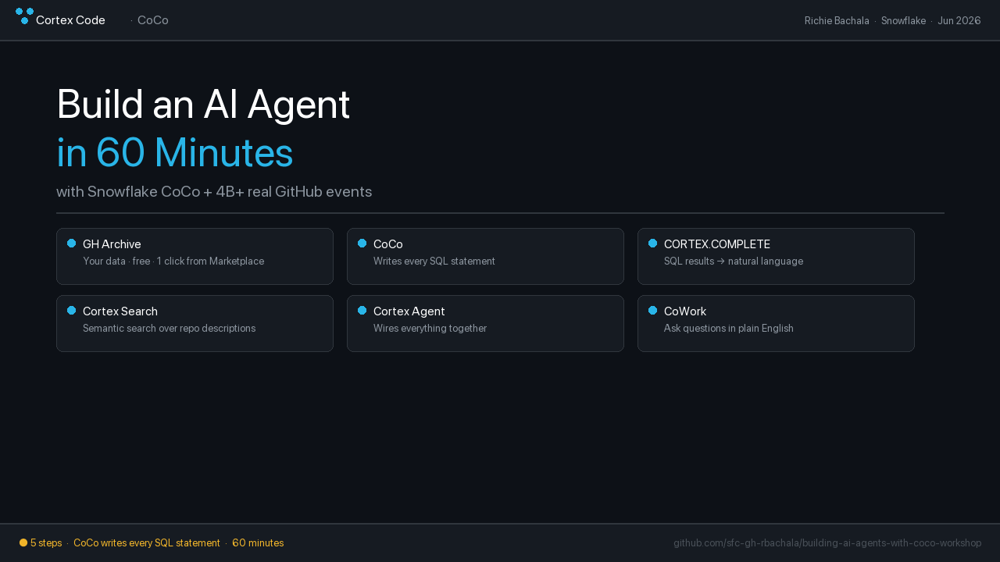
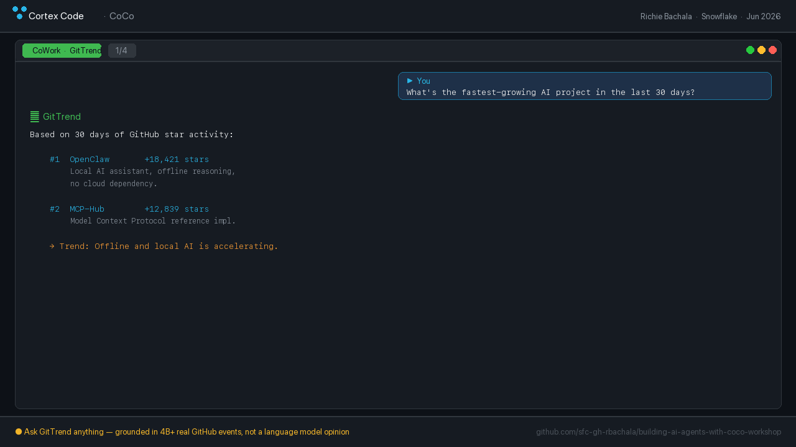
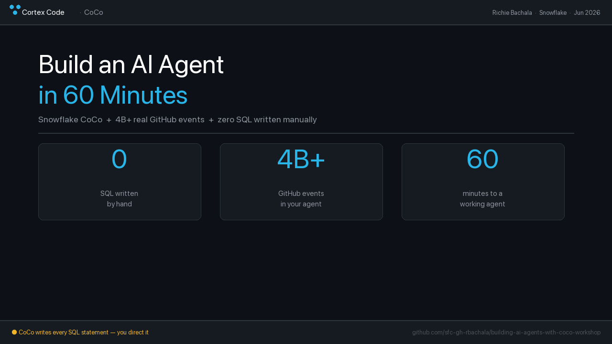

# Building AI Agents with Snowflake CoCo

**TechEquity AI Forum — June 30, 2026 | 7:00 PM | Snowflake SVAI Hub, Menlo Park**

Workshop materials for *Build an AI Agent in 60 Minutes with Snowflake CoCo*, presented by [Richie Bachala](https://www.snowflake.com/en/blog/authors/richie-bachala/), Solutions Architecture Leader at Snowflake.



---

## What You'll Build

**GitTrend** — a working Cortex AI agent that answers natural language questions about trending GitHub repositories, powered by 4 billion+ real GitHub events from the GH Archive.



Ask it things like:
- *"What's the fastest-growing AI project in the last 30 days?"*
- *"What languages dominate trending repos right now?"*
- *"Is there anything trending around agentic AI or MCP this month?"*

CoCo writes every SQL statement. You direct it. You own the result.

---

## Before You Arrive (Do This First)

Complete these steps **before June 30** so we can skip setup during the session.

### 1. Create a free Snowflake trial account
Go to [snowflake.com/try](https://snowflake.com/try) → Sign up → Choose **AWS US East**.

### 2. Mount the GH Archive dataset
In Snowsight (Snowflake's UI):
1. Left nav → **Data Products → Marketplace**
2. Search: `GH Archive` → **Get**
3. Database name: `GH_ARCHIVE` (keep default) → **Get**

Free. No import. One click.

### 3. Run the one-time setup SQL
Open a new SQL Worksheet in Snowsight and run:

```sql
USE ROLE ACCOUNTADMIN;
CREATE DATABASE IF NOT EXISTS GITTREND_DB;
CREATE SCHEMA IF NOT EXISTS GITTREND_DB.PUBLIC;
CREATE WAREHOUSE IF NOT EXISTS WORKSHOP_WH WAREHOUSE_SIZE = XSMALL AUTO_SUSPEND = 60;
USE DATABASE GITTREND_DB;
USE SCHEMA GITTREND_DB.PUBLIC;
USE WAREHOUSE WORKSHOP_WH;
ALTER ACCOUNT SET CORTEX_ENABLED_CROSS_REGION = 'ANY_REGION';
```

### 4. Verify CoCo is available
In Snowsight, look for **CoCo** in the left nav.
If you don't see it: **Admin → Snowsight Features → Enable CoCo**.

---

## Workshop Files

| File | What it is |
|---|---|
| [`WORKSHOP-GUIDE.md`](WORKSHOP-GUIDE.md) | Step-by-step guide — follow this during the session |
| [`CHECKPOINTS.sql`](CHECKPOINTS.sql) | Fallback SQL for each step — use if CoCo gets stuck |
| [`BLOG.md`](BLOG.md) | Post-event writeup |

---

## The 5-Step Pattern



```
1. Mount the data        →  GH Archive from Marketplace (free, one click)
2. CoCo explores         →  Describe the schema, find the right columns
3. Build the query       →  Trending AI repos by star activity, last 30 days
4. Add CORTEX.COMPLETE   →  Turn SQL results into natural language
5. Wire the agent        →  Cortex Search + Cortex Agent = GitTrend
```

Same pattern works on any dataset in your organization.

---

## Resources

- [Free Snowflake trial](https://snowflake.com/try)
- [CoCo documentation](https://docs.snowflake.com/en/user-guide/snowflake-cortex/cortex-code)
- [Getting Started with Cortex Agents](https://www.snowflake.com/en/developers/guides/getting-started-with-cortex-agents/)
- [Build an End-to-End App with CoCo](https://www.snowflake.com/en/developers/guides/sfguide-build-end-to-end-ai-app-on-snowflake/)
- [Getting Started with Snowflake CoWork](https://www.snowflake.com/en/developers/guides/getting-started-with-snowflake-cowork/)
- [Getting Started with the Snowflake MCP Server](https://www.snowflake.com/en/developers/guides/getting-started-with-snowflake-mcp-server/)
- [Getting Started with Snowflake Cortex AI](https://quickstarts.snowflake.com/guide/getting-started-with-snowflake-cortex-ai/)

---

## About the Presenter

**Richie Bachala** — Solutions Architecture Leader, Snowflake  
[snowflake.com/en/blog/authors/richie-bachala](https://www.snowflake.com/en/blog/authors/richie-bachala/)

---

*TechEquity AI Forum | June 30, 2026 | Snowflake SVAI Hub, 135 Constitution Dr, Menlo Park, CA*
